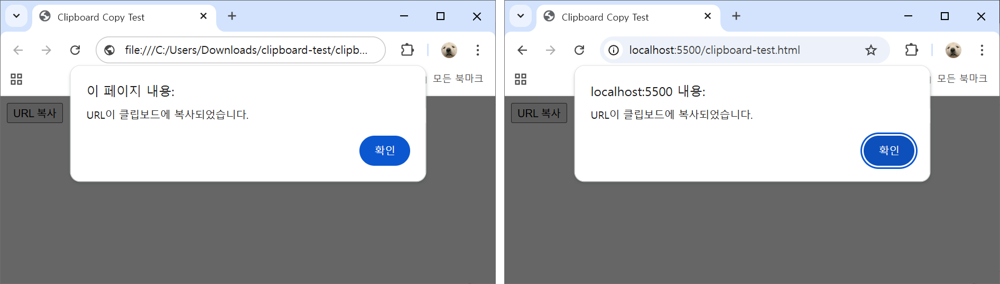

# Clipboard Copy

 

현재 URL을 클립보드에 복사하는 기능을 구현한 프로젝트입니다.

관련 내용은 [블로그 글](https://velog.io/@kimkaaa/JS-%EB%B2%84%ED%8A%BC-%ED%81%B4%EB%A6%AD-%EC%8B%9C-URL%EC%9D%84-%ED%81%B4%EB%A6%BD%EB%B3%B4%EB%93%9C%EC%97%90-%EB%B3%B5%EC%82%AC%ED%95%98%EB%8A%94-%EA%B8%B0%EB%8A%A5-%EA%B5%AC%ED%98%84)에서 확인할 수 있습니다.

 

## 구현 방식

- **Clipboard API 우선 사용**: 최신 브라우저 환경에서 표준 API 활용
- **Fallback 지원**: 제한된 환경을 위한 `execCommand('copy')` 방식 구현
- **다양한 브라우저 환경 고려**: 모바일 Safari 등 예외적인 동작 환경 대응

 

## 기술 스택

- HTML5
- JavaScript (ES6+)

 

## 실행 방법

1. 프로젝트 폴더를 VS Code에서 엽니다
2. Live Server 확장을 실행합니다
3. 브라우저에서 열린 페이지의 **URL 복사** 버튼을 클릭
4. 현재 페이지 주소가 클립보드에 복사됩니다

 

## 실행 화면

  

 

## 참고

- **HTTPS 환경**: Clipboard API는 보안 컨텍스트(HTTPS)에서 동작합니다  
- **localhost 예외**: `http://localhost`는 보안 컨텍스트로 간주되어 Clipboard API를 사용할 수 있습니다  
- **file:// 프로토콜**: HTML 파일을 직접 열어 실행할 경우(`file://`), 브라우저 정책에 따라 동작이 달라질 수 있습니다
